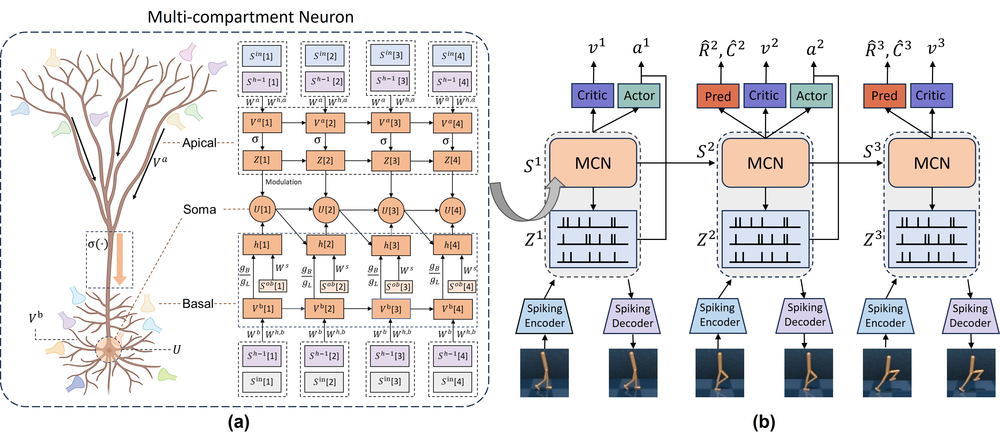

<div align="center">

<h1>Spiking World Model with Multi-Compartment Neurons for Model-based Reinforcement Learning</h1>

[Yinqian Sun](https://scholar.google.com/citations?user=QtGgt2wAAAAJ&hl=zh-CN)<sup>1,4</sup>,
[Feifei Zhao](https://scholar.google.com/citations?hl=zh-CN&user=_-3Hn-EAAAAJ)<sup>1,3,4</sup>,
Mingyang Lyu<sup>1,2</sup>,
[Yi Zeng](https://scholar.google.com/citations?user=Rl-YqPEAAAAJ&hl=zh-CN)<sup>1,2,3,4</sup>,


<sup>1</sup>Brain-inspired Cognitive AI Lab, Institute of Automation, Chinese Academy of Sciences, 
<sup>2</sup>School of Artificial Intelligence, University of Chinese Academy of Sciences
<sup>3</sup>State Key Laboratory of Brain Cognition and Brain-inspired Intelligence Technology
<sup>4</sup>Long-term AI

[](https://arxiv.org/abs/2503.00713)
[](https://www.pnas.org/doi/abs/10.1073/pnas.2513319122)

</div>


## 💡 Introduction
**Spiking-WM** is a brain-inspired **spiking world model** for model-based reinforcement learning that introduces **multi-compartment neurons (MCNs)** to equip SNNs with long-term temporal memory. Inspired by nonlinear dendritic integration in biological neurons, Spiking-WM integrates a spiking state-space model, a spiking encoder, and a spiking policy network to enable end-to-end planning and decision-making. Experiments on the DeepMind Control Suite demonstrate that Spiking-WM outperforms existing SNN-based approaches and achieves performance comparable to GRU-based ANN world models, while evaluations on long-sequence speech benchmarks (SHD, TIMIT, and LibriSpeech 100h) further confirm its superior capability for modeling long-range temporal dependencies.

<div style="text-align: center;">
  
</div>

## 📢 News
[2025-12-12] Spiking-WM has been published online in Proceedings of the National Academy of Sciences ([PNAS](www.pnas.org/doi/10.1073/pnas.2513319122)).

## Table of Contents
- [💡 Introduction](#-introduction)
- [📢 News](#-news)
- [Table of Contents](#table-of-contents)
- [🛠️ Installation](#️-installation)
- [🚀 Training](#-training)
- [📜 Citing](#-citing)
- [🙏 Acknowledgement](#-acknowledgement)
<p align="right"><a href="#readme-top"></a></p>

## 🛠️ Installation

Create the required environment through the following steps:

```bash
conda env create -f environment.yml
conda activate spiking-wm
pip install -r requirements.txt
```
<p align="right"><a href="#readme-top"></a></p>


## 🚀 Training

```bash
bash scripts/train.sh
```


<p align="right"><a href="#readme-top"></a></p>


## 📜 Citing

If you find Spiking-WM is useful in your research or applications, please consider giving us a star 🌟 and citing it by the following BibTeX entry:

```
@article{sun2025spiking,
author = {Yinqian Sun  and Feifei Zhao  and Mingyang Lyu  and Yi Zeng },
title = {Spiking world model with multicompartment neurons for model-based reinforcement learning},
journal = {Proceedings of the National Academy of Sciences},
volume = {122},
number = {50},
pages = {e2513319122},
year = {2025},
doi = {10.1073/pnas.2513319122},
URL = {https://www.pnas.org/doi/abs/10.1073/pnas.2513319122},
eprint = {https://www.pnas.org/doi/pdf/10.1073/pnas.2513319122},
}
```
The model of this research is one of the core and part of [BrainCog Embot](https://www.brain-cog.network/embot).BrainCog Embot is an Embodied AI platform under the Brain-inspired Cognitive Intelligence Engine (BrainCog) framework, which is an open-source Brain-inspired AI platform based on Spiking Neural Network. 
```
@article{zeng2023braincog,
title={BrainCog: A spiking neural network based, brain-inspired cognitive intelligence engine for brain-inspired AI and brain simulation},
author={Zeng, Yi and Zhao, Dongcheng and Zhao, Feifei and Shen, Guobin and Dong, Yiting and Lu, Enmeng and Zhang, Qian and Sun, Yinqian and Liang, Qian and Zhao, Yuxuan and others},
journal={Patterns},
volume={4},
number={8},
year={2023},
publisher={Elsevier}
}
```

<p align="right"><a href="#readme-top"></a></p>


## 🙏 Acknowledgement
Our work is primarily based on the following codebases:[dreamerv3-torch](https://github.com/NM512/dreamerv3-torch). We are sincerely grateful for their work.

